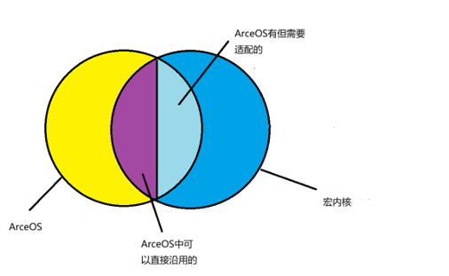

# 中期报告

> 姓名：郑友捷


## 亮点

* 对 ArceOS 的 Rust 程序的兼容，即 Unikernel 和 宏内核编译期兼容启动
* 对同一份源代码，不需要改变本身代码内容，只需要**通过改变编译指令、连接到不同的库，就可以实现不同内核架构启动**，为开发和实际运行提供方便。


## Starry 的 Unikernel 兼容

StarryOS 是基于 Unikernel 架构的 ArceOS 并进行一定改造得到的宏内核。理论上它可以在编译期通过调整编译参数实现宏内核和 Unikernel 两种架构的选择性启动。但是由于比赛时期紧张，同时比赛的测例运行需求比较特殊，导致 StarryOS 对 Unikernel 架构的启动支持不是很好，无法运行 ArceOS 的原生 Rust 程序。

### feature 划分

当前想要做到的是编译期进行架构的区别，因此我选择**通过 feature 的方式**对两者进行区分。


由于宏内核默认是启动所有的模块，从而构成一个整体（讨论的定制化宏内核除外），因此我们设置一个 feature 为 monolithic，代表启动宏内核架构。**当这个 feature 启动时，其他所有的模块都会被包含进来，如文件系统、信号模块、进程控制等等**。


### 模块划分与修改

为了更好地进行模块复用，我们先需要对 Starry 中的模块关系进行划分，将其根据 **宏内核是否需要** 和 **ArceOS 是否拥有** 两个标准进行划分。



具体对应到 Starry 上拥有的模块关系如下：

* ArceOS 中可直接沿用：log、driver 以及一系列解耦的 crate
* ArceOS 中需要适配：任务模块 axtask 、trap异常处理 axhal 等
* ArceOS 中需要添加：地址空间、进程、信号、文件系统、用户库


相比于 Unikernel，宏内核需要新增地址空间、进程管理等一系列模块，但是这与我们想要做的与 Unikernel 兼容的内容关系不大。我们更多的是强调适配模块的调整，即如何让复用模块能够**同时为两种架构提供服务**。


具体的修改详见[Starry/doc/OS-Train-Repo/Week2.md at feat/module · Azure-stars/Starry (github.com)](https://github.com/Azure-stars/Starry/blob/feat/module/doc/OS-Train-Repo/Week2.md)。我们在这里重点强调 axtask 模块的修改。


任务模块需要修改的内容较多。在宏内核下，原先 ArceOS 的任务模块承担了宏内核中的线程方面的功能。而为了保证**尽量不对 ArceOS 原有模块过多修改**，方便 ArceOS 复用，因此我们将 进程 和 线程控制块分开了。

在这种设计下，线程需要在原有基础上记录更多内容，比如所属进程 ID、计时器信息、CPU亲和力信息（用于实现`SCHED_SETAFFINITY`等系统调用）等，用于完成一系列的 Linux 系统调用。

我考虑了两种设计方法：

1. 在原有任务结构的基础上**通过 feature 的方式添加成员域**
2. 新建一个任务结构，**继承原有的任务结构，以 trait 的方式实现宏内核相关的内容**，在不同架构下选用不同的结构

为了实现方便起见，我选用了第一种。


则在这种情况下， feature 的作用可以概括为两点：

1. 通过 feature 添加成员域或者额外处理语句

2. 通过 feature 选择不同的分支语句

   


#### 通过 feature 添加成员域或者额外处理语句

我对任务结构的修改如下：

```rust
pub struct TaskInner {
    id: TaskId,
    name: String,
    is_idle: bool,
    is_init: bool,

	。。。

    #[cfg(feature = "tls")]
    tls: TlsArea,

    #[cfg(feature = "monolithic")]
    process_id: AtomicU64,

    #[cfg(feature = "monolithic")]
    /// 是否是所属进程下的主线程
    is_leader: AtomicBool,

    #[cfg(feature = "monolithic")]
    /// 初始化的trap上下文
    pub trap_frame: UnsafeCell<TrapFrame>,

    #[cfg(feature = "monolithic")]
    pub page_table_token: usize,

    #[cfg(feature = "monolithic")]
    set_child_tid: AtomicU64,

    #[cfg(feature = "monolithic")]
    clear_child_tid: AtomicU64,

    // 时间统计, 无论是否为宏内核架构都可能被使用到
    #[allow(unused)]
    time: UnsafeCell<TimeStat>,

    #[cfg(feature = "monolithic")]
    pub cpu_set: AtomicU64,

    #[cfg(feature = "monolithic")]
    pub sched_status: UnsafeCell<SchedStatus>,

    #[cfg(feature = "monolithic")]
    /// 退出时是否向父进程发送SIG_CHILD
    pub send_sigchld_when_exit: bool,
}
```

可以看到其上添加了许多 feature 信息，看上去虽然有些冗余，但也可以勉强完成两者区分的目的，同时不会过度影响上层模块对于 TaskInner 结构的使用。


#### 通过 feature 选择不同的分支语句

我们以启动语句为例。

* 对于 Unikernel 的启动，由于不涉及地址空间的改变，可以直接通过调用任务入口函数的方式来进入到任务的执行中。
* 对于宏内核的启动，需要涉及到特权级的切换，因此要进行一些额外的处理，如在内核栈压入 trap 上下文，该操作在`first_into_user`中实现。

则对应 Starry 实现如下：

```rust
extern "C" fn task_entry() -> ! {
    // release the lock that was implicitly held across the reschedule
    unsafe { crate::RUN_QUEUE.force_unlock() };
    #[cfg(feature = "irq")]
    axhal::arch::enable_irqs();
    let task = crate::current();
    if let Some(entry) = task.entry {
        cfg_if::cfg_if! {
            if #[cfg(feature = "monolithic")] {
                use axhal::KERNEL_PROCESS_ID;
                if task.get_process_id() == KERNEL_PROCESS_ID {
                    // 是初始调度进程，直接执行即可
                    unsafe { Box::from_raw(entry)() };
                    // 继续执行对应的函数
                } else {
                    // 需要通过切换特权级进入到对应的应用程序
                    let kernel_sp = task.get_kernel_stack_top().unwrap();
                    let frame_address = task.get_first_trap_frame();
                    first_into_user(kernel_sp, frame_address as usize);
                }
            }
            else {
                unsafe { Box::from_raw(entry)() };
            }

        }
    }
    // only for kernel task
    crate::exit(0);
}
```


通过如上 feature 使用方法，对各个模块进行兼容修改，就可以保证每一个模块在是否开启 monolithic feature 的情况下选择正确的处理方法。

当然，这种做法的前提是**足够合理的模块划分**，才能保证使用 feature 的场合尽量少，否则和重写一个内核区别不大。而 ArceOS 自身模块化的特性使得原本 modules 的划分便足够细致，因此在改造过程中，用到 feature 比较多的模块便只有 axtask 模块，其他都是只要略加修改便可完成适配。这就是模块化操作系统用来实现多架构兼容的优势。


### 通过 ArceOS 原先的测例

但是由于比赛时期较赶，且缺少规范的 CI-CD，并没有保证 Starry 代码可以始终通过原有 ArceOS 测例。但是现在为了做到两种架构的实时兼容，需要先保证能够通过各自的测例。

对于这些测例的具体调试过程体现在日志中，详见[Starry/doc/OS-Train-Repo/Week3.md at feat/module · Azure-stars/Starry (github.com)](https://github.com/Azure-stars/Starry/blob/feat/module/doc/OS-Train-Repo/Week3.md)，不在总结报告中赘述。


## 代码自选架构启动

底层架构处理好了之后，需要考虑的是用户如何方便地选择不同的架构启动。

以 C 语言为例，我们期望的是代码通过选择链接不同的库，从而启动不同的架构。发现 ArceOS 方面，晏巨广学长正在做 ArceOS 上的 musl-libc 支持。他为 C 的链接库接口提供了对应的 ArceOS_posix_api 支持。若将 C 代码链接到 axlibc 上，便可以启动 Unikernel 来处理这份程序。

对于宏内核，考虑到宏内核加载应用的时候需要分析对应的 ELF 文件，建构起对应的地址空间，所以不选择和晏巨广学长一样重写一份链接库，而是将 C 代码在外部编译为可执行文件之后加载到文件镜像中执行，即 C 代码链接的库是外部 C 编译器自带的库。

为了方便启动，我修改了 Makefile，对编译方式进行修改：

* 当指定`STRUCT=Monolithic`时，采用宏内核启动，

  ```shell
  $  make A=apps/c/helloworld STRUCT=Monolithic run
  ```

  此时会对指定的源代码进行如下操作：

1. 通过外部编译器，如 riscv-musl-gcc 编译器，将源代码连接到外部 C 代码库，对源代码进行编译

2. 将得到的可执行文件打包到文件镜像中

3. 启动宏内核，读取外部的可执行文件，开始运行

   有如下运行结果：

   

   

* 当不指定时，采用 Unikernel 启动，此时源代码会连接到 axlibc，把应用程序和内核打包为一个镜像进行启动。


## 测试 Starry 和 ArceOS

制作了兼容了 Unikernel 和宏内核架构的 OS 之后，一个比较重要的问题便是这种模块化的 OS 是否会对性能造成影响。因此需要对内核进行测试。

根据宏内核 和 Unikernel 的异同之处，考虑从以下几个方面来进行测例测试：

* 性能：
  * 文件：包括读写等内容
  * 任务：新建线程、任务切换
  * 内存分配：动态分配堆内存
* 安全性：
  * 非法访问地址测试


详细测试结果在[Starry/doc/OS-Train-Repo/Week4.md at feat/module · Azure-stars/Starry (github.com)](https://github.com/Azure-stars/Starry/blob/feat/module/doc/OS-Train-Repo/Week4.md)

结论：

1. 基于同样的底层模块，宏内核相比于 Unikernel 架构，会花费更多的时间在特权级切换、trap 上下文的存储和恢复、参数安全性检查上，因此性能会有一定下降。

2. 由于宏内核支持的多进程和信号捕获机制，他能够在任务发生异常的时候捕获并进行对应的处理，而不至于直接使得整个内核终止。

   这一点结合上面的自选架构启动，可以帮助应用在开发过程中较为方便地进行调试，即只需要将应用作为子进程进行启动，而父进程**在宏内核下可以较为方便地捕获子进程的错误信息**。当子进程开发完毕，只需要简单的改变链接库，同时脱离父进程单独启动，就可以**在 Unikernel 架构下以较高的性能运行**。

3. 本地 Linux 环境虽然是在宏内核下，但是他在一系列方面做了优化，如 syscall 的调用、任务调度策略等，导致直接调用多次 syscall 并不能看出宏内核和 Unikernel 的性能差距，仍需要设计更多具有针对性的测例。