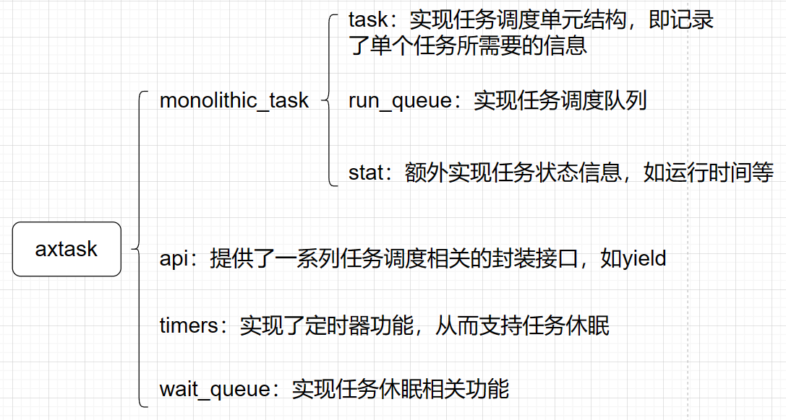

任务调度是内核实现过程中非常重要的环节。为了保证和上游arceos仓库较好的进行匹配，因此starry的任务调度机制基本参照了arceos的调度机制，并在此基础上进行了适配宏内核的调整。

为了实现宏内核架构体系，需要对原有Arceos的部分核心模块（如axtask）进行修改。为了防止合并时冲突过多，因此在对应模块下建立`monolithic_task`文件夹，存放为宏内核架构实现的内容。同时使用条件编译来选择是宏内核架构还是unikernel架构。

以下为Starry实现的任务调度模块的相关功能划分：



对功能的额外补充说明如下：

#### task

任务单元是内核运行过程中非常重要的组成部分，任务调度模块的组成如下：

```rust
pub struct TaskInner {
    id: TaskId,
    name: String,
    is_idle: bool,
    is_init: bool,

    entry: Option<*mut dyn FnOnce()>,
    state: AtomicU8,

    in_wait_queue: AtomicBool,
    #[cfg(feature = "irq")]
    in_timer_list: AtomicBool,

    #[cfg(feature = "preempt")]
    need_resched: AtomicBool,
    #[cfg(feature = "preempt")]
    pub preempt_disable_count: AtomicUsize,

    exit_code: AtomicI32,
    wait_for_exit: WaitQueue,

    #[cfg(feature = "monolithic")]
    kstack: Option<TaskStack>,

    ctx: UnsafeCell<TaskContext>,

    #[cfg(feature = "monolithic")]
    // 对应进程ID
    process_id: AtomicU64,

    #[cfg(feature = "monolithic")]
    /// 是否是所属进程下的主线程
    is_leader: AtomicBool,

    #[cfg(feature = "monolithic")]
    // 所属页表ID，在宏内核下默认会开启分页，是只读的所以不用原子量
    page_table_token: usize,

    #[cfg(feature = "monolithic")]
    /// 初始化的trap上下文
    pub trap_frame: UnsafeCell<TrapFrame>,
    
    // 时间统计
    #[cfg(feature = "monolithic")]
    time: UnsafeCell<TimeStat>,

    #[allow(unused)]
    #[cfg(feature = "monolithic")]
    /// 子线程初始化的时候，存放tid的地址
    set_child_tid: AtomicU64,

    #[cfg(feature = "monolithic")]
    /// 子线程初始化时，将这个地址清空；子线程退出时，触发这里的 futex。
    /// 在创建时包含 CLONE_CHILD_SETTID 时才非0，但可以被 sys_set_tid_address 修改
    clear_child_tid: AtomicU64,

    #[cfg(feature = "monolithic")]
    /// 退出时是否向父进程发送SIG_CHILD
    pub send_sigchld_when_exit: Bool,
}
```

可以看出，任务结构体中的某些字段包含着多核安全性，因为虽然一个任务仅会在一个CPU核上运行，但是不同CPU可能会同时访问同一个任务的某一个字段，导致出现多核冲突，因此需要为对应字段加上原子性。


另外，task字段也提供了某一个任务第一次执行的实现。它需要根据是否为宏内核架构分别进行实现。

* Arceos实现：在Arceos下，代码始终在内核态下运行，所以可以直接跳转到任务入口函数执行。因此会把入口函数的地址直接记录在task的entry字段上，并且在第一次执行任务时直接跳转到entry字段的地址即可。
* Starry实现：在Starry下，任务会进入到用户态运行，此时需要把任务初始化的trap上下文放置到内核栈上，并且进行sret跳转。


### run_queue

任务调度是任务模块实现的重点。接下来简要介绍以下starry的任务启动和调度流程。


当前任务调度机制是fifo队列法，启动和调度方式如下：

* 单核情况

  对应代码在`modules/axtask/src/monolithic_task/run_queue.rs/init`函数中：

  ```rust
  pub(crate) fn init() {
      const IDLE_TASK_STACK_SIZE: usize = 0x20000;
      let idle_task = TaskInner::new(
          || crate::run_idle(),
          "idle".into(),
          IDLE_TASK_STACK_SIZE,
          KERNEL_PROCESS_ID,
          0,
          false,
      );
      IDLE_TASK.with_current(|i: &mut LazyInit<Arc<scheduler::FifoTask<TaskInner>>>| {
          i.init_by(idle_task.clone())
      });
  
      let main_task = TaskInner::new_init("main".into());
      main_task.set_state(TaskState::Running);
  
      RUN_QUEUE.init_by(AxRunQueue::new());
      unsafe { CurrentTask::init_current(main_task) }
  }
  ```

  共包含三个任务：

  * idle_task：拥有独立的trap上下文和任务上下文，任务上下文指向的入口是`run_idle`函数。

  * gc_task：在执行`AxRunQueue::new()`函数时生成，负责回收已经退出的任务。

  * main_task：内核运行时执行的任务，它的任务上下文为空，在被切换时会把当前的ra等信息写入任务上下文，从而可以在恢复时继续执行内核相关代码。

  当执行完init函数之后，CPU指向main_task，pc不变，继续执行当前代码，直到来到`modules/axruntime/src/lib.rs/rust_main`函数的`unsafe{main();}`入口，从而跳转到Arceos指定的用户程序（**注意：虽然是用户程序，但是运行在arceos框架下，还处于内核态**），开始加载测例。默认`make run`会运行`apps/syscall/busybox`程序。若测例程序会通过`clone`等方式生成新的任务，那么新任务会被加入到任务调度队列等待被调度。

  * 若调度队列中还有任务等待被调度，那么就会切换到对应任务。此时若调度的任务是gc，则gc会检测是否还有任务退出。若有任务已经退出等待回收，则gc会回收这些任务。若没有则阻塞gc本身，切换到其他任务。

    gc的实现方式如下：

    ```rust
    fn gc_entry() {
        loop {
            // Drop all exited tasks and recycle resources.
            while !EXITED_TASKS.lock().is_empty() {
                // Do not do the slow drops in the critical section.
                let task = EXITED_TASKS.lock().pop_front();
                if let Some(task) = task {
                    // If the task reference is not taken after `spawn()`, it will be
                    // dropped here. Otherwise, it will be dropped after the reference
                    // is dropped (usually by `join()`).
                    // info!("drop task: {}", task.id().as_u64());
                    drop(task);
                }
            }
            WAIT_FOR_EXIT.wait();
        }
    }
    ```

  * 若调度队列中没有下一个任务时，就会切换到idle_task，此时会执行`run_idle`函数，即不断执行`yield_task`函数，直到有新的任务加入调度队列，则切换到对应任务。

    run_idle函数实现方式如下：

    ```rust
    pub fn run_idle() -> ! {
        loop {
            yield_now();
            debug!("idle task: waiting for IRQs...");
            #[cfg(feature = "irq")]
            axhal::arch::wait_for_irqs();
        }
    }
    ```


* 多核启动

  我们只考虑任务调度相关，则多核情况下，其他核初始化的函数在`modules/axtask/src/monolithic_task/run_queue.rs/init_secondary`中，会新建一个`idle_task`，但是它的功能类似于单核启动下的`main_task`，即初始化时没有任务上下文，但是可以在被切换之后保留内核的任务执行流。

  初始化完毕之后，每一个非主核指向一个`idle_task`，此时他们会继续执行内核中的初始化代码，最后在`modules/axruntime/src/mp.rs`的`rust_main_secondary`函数中执行`run_idle`函数，即不断地`yield`自己，直到有新的任务加入调度队列。

  当测例对应的用户态任务执行`clone`系统调用，生成新的任务加入到调度队列时，此时就会随机分配一个CPU核获得该任务并且进行执行。这就是多核启动的原理。


### stat

stat实现了任务的时间记录功能和计时器功能。

记录任务运行时间是通过计算和更新时间戳进行的，每一个stat结构体都拥有如下结构：

```rust
/// 用户态经过的时间，单位为纳秒
utime_ns: usize,
/// 内核态经过的时间，单位为纳秒
stime_ns: usize,
/// 进入用户态时标记当前时间戳，用于统计用户态时间
user_tick: usize,
/// 进入内核态时标记当前时间戳，用于统计内核态时间
kernel_tick: usize,
```

更新时间戳的时间点共有四个：

* 从用户态进入内核态
* 从内核态进入用户态
* 切换到本任务
* 本任务被切换走

相关更新运行时间的代码如下：

```rust
/// 从用户态进入内核态，记录当前时间戳，统计用户态时间
pub fn into_kernel_mode(&mut self, tid: isize) {
    let now_time_ns = current_time_nanos() as usize;
    let delta = now_time_ns - self.user_tick;
    self.utime_ns += delta;
    self.kernel_tick = now_time_ns;
}
/// 从内核态进入用户态，记录当前时间戳，统计内核态时间
pub fn into_user_mode(&mut self, tid: isize) {
    // 获取当前时间，单位为纳秒
    let now_time_ns = current_time_nanos() as usize;
    let delta = now_time_ns - self.kernel_tick;
    self.stime_ns += delta;
    self.user_tick = now_time_ns;
}
/// 内核态下，当前任务被切换掉，统计内核态时间
pub fn swtich_from(&mut self, tid: isize) {
    // 获取当前时间，单位为纳秒
    let now_time_ns = current_time_nanos() as usize;
    let delta = now_time_ns - self.kernel_tick;
    self.stime_ns += delta;
}
/// 内核态下，切换到当前任务，更新内核态时间戳
pub fn switch_to(&mut self, tid: isize) {
    // 获取当前时间，单位为纳秒
    let now_time_ns = current_time_nanos() as usize;
    let delta = now_time_ns - self.kernel_tick;
    // 更新时间戳，方便当该任务被切换时统计内核经过的时间
    self.kernel_tick = now_time_ns;
}
```
