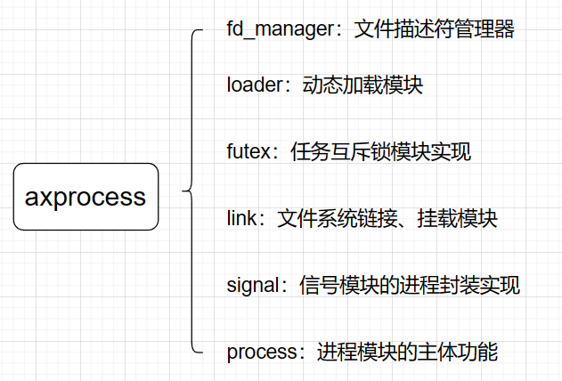

进程部分是宏内核实现的核心部分，它作为一个资源容器收纳了任务、信号、内存、文件系统等模块的功能，并且进行统筹管理。

进程模块的相关功能划分如下



进程模块更多是对已有实现模块的一个总结， 因此该部分的额外说明并不会特别多，仅是起一个总结的作用。

额外补充如下

### process

process部分实现了进程控制块的主体部分，其进程控制块定义如下：

```rust
pub struct ProcessInner {
    /// 父进程的进程号
    pub parent: u64,
    /// 子进程
    pub children: Vec<Arc<Process>>,
    /// 子任务
    pub tasks: Vec<AxTaskRef>,
    /// 地址空间，由于存在地址空间共享，因此设计为Arc类型
    pub memory_set: Arc<SpinNoIrq<MemorySet>>,
    /// 用户堆基址，任何时候堆顶都不能比这个值小，理论上讲是一个常量
    pub heap_bottom: usize,
    /// 当前用户堆的堆顶，不能小于基址，不能大于基址加堆的最大大小
    pub heap_top: usize,
    /// 进程状态
    pub is_zombie: bool,
    /// 退出状态码
    pub exit_code: i32,
    #[cfg(feature = "fs")]
    pub fd_manager: FdManager,
    /// 进程工作目录
    pub cwd: String,
    #[cfg(feature = "signal")]
    /// 信号处理模块    
    /// 第一维代表线程号，第二维代表线程对应的信号处理模块
    pub signal_module: BTreeMap<u64, SignalModule>,

    /// robust list存储模块
    /// 用来存储线程对共享变量的使用地址
    /// 具体使用交给了用户空间
    pub robust_list: BTreeMap<u64, FutexRobustList>,
}
```

可以看出进程控制块内融合了包括文件、信号、互斥锁、内存地址空间等一系列内容，通过feature条件编译的方式可以方便地对模块进行可插拔编译，符合模块化的内核设计思想。

### futex

在进程部分定义了与互斥锁相关的数据结构`FUTEX_WAIT_TASK`，其是一个从地址到任务指针的map映射，存储了每一个futex变量对应的正在等待的任务序列。

之所以将该数据结构定义在axprocess模块，是因为需要在进程退出时，清空`FUTEX_WAIT_TASK`中存储的进程Arc指针，从而保证对象能够完整被释放。

`futex`的完整实现在`starry/syscall/futex`中。